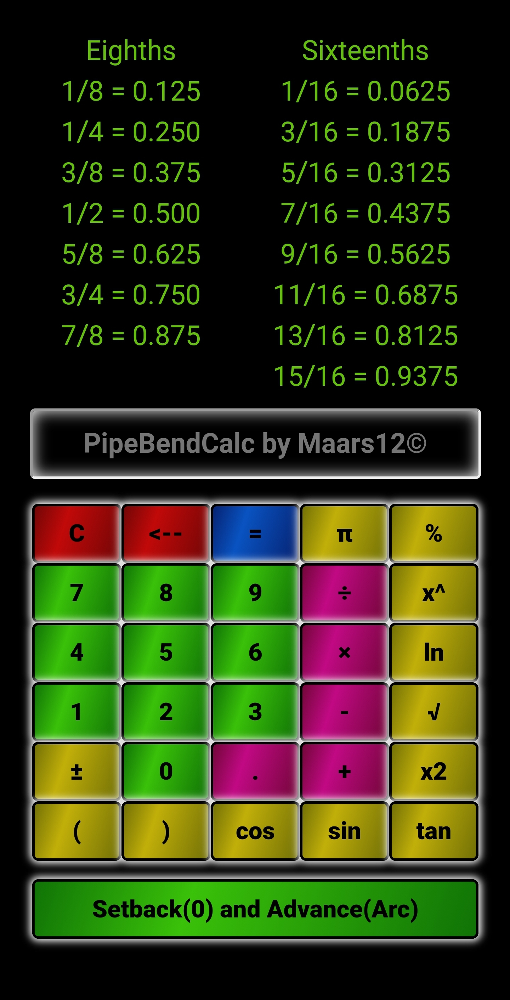

# PipeBendCalcV5+ by MaArs12

    

## Table of Contents

* [Prerequisites](#prerequisites)
* [Built With](#built-with)
* [Contributing](#contributing)
* [Version](#version)
* [Authors](#authors)
* [License](#license)
* [Acknowledgements](#acknowledgements)

## Description

Inspired by pipefitters and electricians in the semiconductor industry who use the progressive 3 mark pipe bending method to layout and bend their steel tubing. This is a scientific calculator that has a fraction to decimal cheat sheet always on screen and a setback(0) and advance(arc) button to quickly figure your zero marks and arc marks.

### Prerequisites

Google Play Store - Download
https://play.google.com/store/apps/details?id=com.maars12.pipbendcalc

## Built With

* Java 
* Android 
* Javascript 
* XML 
* HTML5 
* CSS3 
* Gradle
* Bootstrap4

## Contributing

Alex Garber & Marcus Travis w/Maars12 Development Group

## Version

#1.0.5

## Authors

Alex Garber & Marcus Travis

## License

MIT

## Acknowledgements

Inspired by craftsman in the field.
Thanks to any and all free and open source libraries used!
